# Sigma Casino Payment System

A comprehensive casino payment system built on Polygon, featuring secure token management, treasury operations, and casino registration capabilities.

## System Architecture

```mermaid
graph TB
    %% Main System Architecture
    subgraph "Sigma Ecosystem"
        direction TB
        
        %% Top Level Registry
        subgraph "CasinoPaymentRegistry"
            direction TB
            CPR[Registry Core]
            CPR --> WL[Whitelist System]
            CPR --> CA[Casino Admin Management]
            CPR --> CTI[Treasury Implementation]
            CPR --> CR[Casino Registration]
        end

        %% Treasury Layer
        subgraph "CasinoTreasury"
            direction TB
            CT[Treasury Core]
            CT --> EB[Escrow System]
            CT --> FB[Fee Management]
            CT --> UB[User Balances]
            CT --> WB[Winnings System]
            CT --> WD[Withdrawal System]
        end

        %% Vault Layer
        subgraph "SigmaVault"
            direction TB
            SV[Vault Core]
            SV --> AP[Aave Integration]
            SV --> ATB[aToken Management]
            SV --> ADM[Admin System]
            SV --> SD[Share Distribution]
        end

        %% Token Layer
        subgraph "CHIPTEST"
            direction TB
            CHIP[Token Core]
            CHIP --> BL[Blacklist System]
            CHIP --> MS[Supply Control]
            CHIP --> VT[Vault Control]
            CHIP --> TR[Transfer Restrictions]
        end
    end

    %% External Systems
    subgraph "External Integrations"
        direction LR
        AAVE[Aave Protocol]
        ERC20[ERC20 Standard]
    end

    %% Main Relationships
    CPR -->|Deploys & Manages| CT
    CPR -->|Controls| SV
    CPR -->|Governs| CHIP

    %% Internal Relationships
    CT -->|Interacts with| SV
    SV -->|Mints/Burns| CHIP
    CT -->|Uses| CHIP

    %% External Relationships
    SV -->|Integrates with| AAVE
    CHIP -->|Implements| ERC20

    %% Access Control Flow
    CPR -->|Access Control| CT
    CPR -->|Access Control| SV
    CPR -->|Access Control| CHIP

    %% Styling
    classDef registry fill:#f9f,stroke:#333,stroke-width:2px
    classDef treasury fill:#bbf,stroke:#333,stroke-width:2px
    classDef vault fill:#bfb,stroke:#333,stroke-width:2px
    classDef token fill:#fbb,stroke:#333,stroke-width:2px
    classDef component fill:#ddd,stroke:#333,stroke-width:1px
    classDef external fill:#fff,stroke:#333,stroke-width:1px

    class CPR,WL,CA,CTI,CR registry
    class CT,EB,FB,UB,WB,WD treasury
    class SV,AP,ATB,ADM,SD vault
    class CHIP,BL,MS,VT,TR token
    class AAVE,ERC20 external
```



## Prerequisites

1. **Node.js and npm:** Ensure you have Node.js (which includes npm) installed. [https://nodejs.org/](https://nodejs.org/)
2. **Git:** Required for cloning if obtained from a repository.
3. **Dependencies:** Install project dependencies:
    ```bash
    npm install
    ```
4. **Environment Variables:** Create a `.env` file in the project root. **Never commit this file to Git!** Add it to your `.gitignore` file. Populate it with your details:

    ```dotenv
    # .env example
    PRIVATE_KEY="YOUR_WALLET_PRIVATE_KEY"
    POLYGONSCAN_API_KEY="YOUR_POLYGONSCAN_API_KEY"
    MUMBAI_RPC_URL="https://rpc.ankr.com/polygon_mumbai"
    POLYGON_RPC_URL="https://polygon-rpc.com"
    ```

## Deployment Workflow

### 1. Deploy CHIPTEST Token
```bash
npx hardhat run scripts/deploy_chip.js --network polygon
```

### 2. Deploy Registry
```bash
npx hardhat run scripts/deploy_registry.js --network polygon
```

### 3. Deploy Treasury Implementation
```bash
npx hardhat run scripts/deploy_treasury_impl.js --network polygon
```

### 4. Set Treasury Implementation in Registry
```bash
npx hardhat run scripts/set_treasury_impl_in_registry.js --network polygon
```

### 5. Whitelist Deployer Address
```bash
npx hardhat run scripts/whitelist_address.js --network polygon
```

### 6. Deploy Vault
```bash
npx hardhat run scripts/deploy_vault.js --network polygon
npx hardhat run scripts/set_vaults.js --network polygon
npx hardhat run scripts/test_vault.js --network polygon
```

### 7. Register New Casino
```bash
npx hardhat run scripts/register_casino.js --network polygon
```

### 8. Set Casino Fees and Limits
```bash
npx hardhat run scripts/set_casino_fees.js --network polygon
npx hardhat run scripts/set_casino_limits.js --network polygon
```

### 9. Test Casino Functionality
```bash
npx hardhat run scripts/test_casino_functionality.js --network polygon
```

## Contract Verification

### Verify CHIP Token
```bash
npx hardhat verify --network polygon 0xDa426963CCCa8BfDc1bd6b87c014d6a62b104b2E
npx hardhat verify --network polygon 0x3E09E1F55780490dFf0C2605Fa3BeeB0513ff74C
```

### Verify Registry
```bash
npx hardhat verify --network polygon <REGISTRY_ADDRESS> "Owner Address" "Initial Platform Fee" "Fee Recipient"
```

### Verify Vault
```bash
npx hardhat verify --network polygon 0x84E0Aa6dF26446166570dFC98207aDAf2980B241 \
"USDT_ADDRESS" \
"USDC_ADDRESS" \
"aPolUSDT_ADDRESS" \
"aPolUSDC_ADDRESS" \
"AAVE_POOL_ADDRESS" \
"CHIP_ADDRESS" \
"CASINO_TREASURY_ADDRESS" \
"INITIAL_OWNER_ADDRESS"
```

## Security Features

### Access Control
- Role-based access control
- Multi-signature requirements
- Timelock delays for admin operations
- Emergency pause functionality

### Asset Protection
- Token blacklisting
- Maximum supply limits
- Transfer restrictions
- Escrow system

### Financial Controls
- Fee caps and limits
- Withdrawal limits
- Balance tracking
- Transaction monitoring

### Emergency Procedures
- Global pause mechanism
- Circuit breaker pattern
- Emergency fund recovery
- Automated suspension triggers

## Testing

Run the test suite:
```bash
npx hardhat test
```

## Security Recommendations

### Critical Security Improvements
- Implement Role-Based Access Control (RBAC)
- Add multi-signature requirements
- Implement timelock delays
- Add emergency pause functionality
- Implement circuit breaker pattern

### Technical Security Measures
- Add reentrancy guards
- Implement rate limiting
- Add contract size checks
- Add slippage protection
- Implement proper decimal handling

### Monitoring & Alerts
- Enhanced event logging
- Suspicious pattern monitoring
- Automated alerts
- Audit logging system

## Maintenance

### Regular Tasks
- Security audits
- Performance monitoring
- System health checks
- Documentation updates
- Emergency procedure testing

### Upgrade Procedures
- Test in staging environment
- Verify storage layout
- Update documentation
- Deploy with timelock
- Verify new implementation

## Support

For technical support or security concerns, please contact the development team.

## License

MIT License